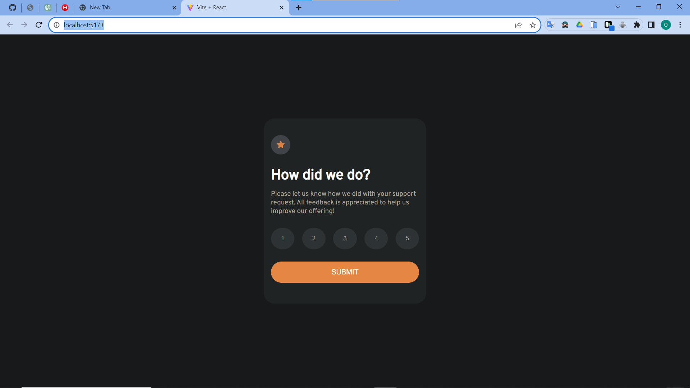
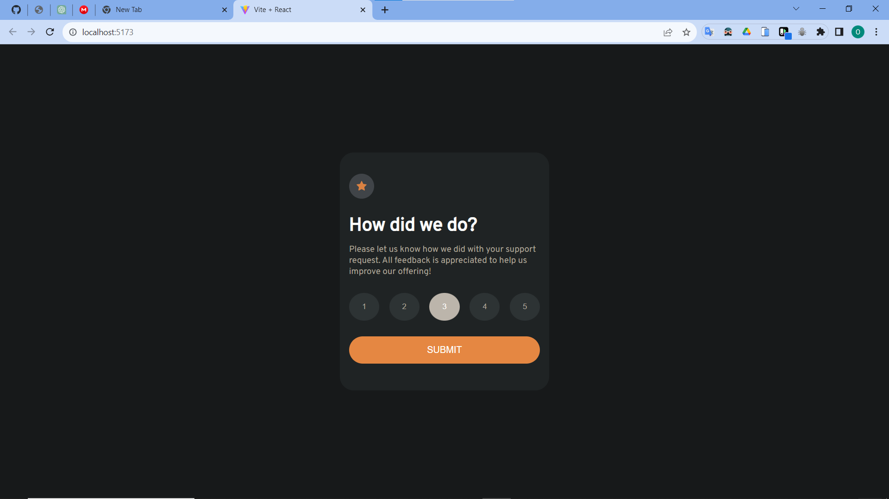
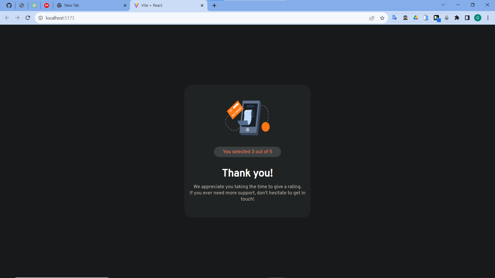
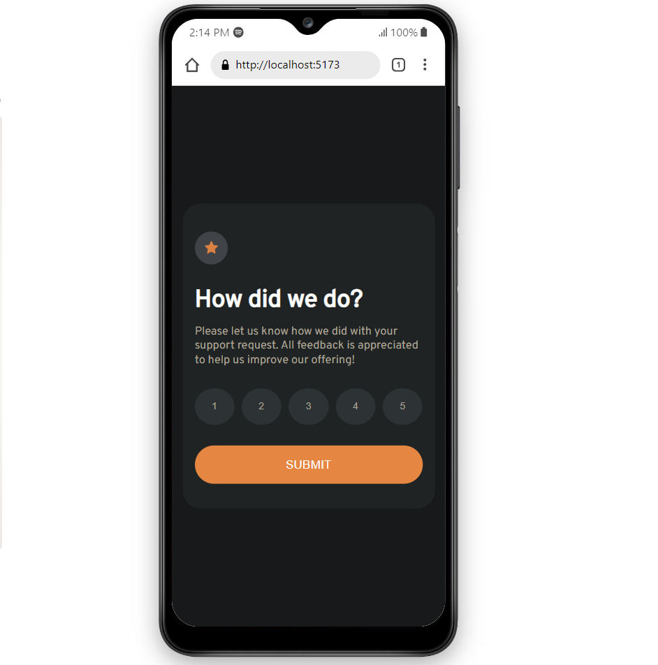

# React + Vite

This template provides a minimal setup to get React working in Vite with HMR and some ESLint rules.

Currently, two official plugins are available:

- [@vitejs/plugin-react](https://github.com/vitejs/vite-plugin-react/blob/main/packages/plugin-react/README.md) uses [Babel](https://babeljs.io/) for Fast Refresh
- [@vitejs/plugin-react-swc](https://github.com/vitejs/vite-plugin-react-swc) uses [SWC](https://swc.rs/) for Fast Refresh

# Frontend Mentor - Interactive Rating Component Solution

This is my solution to the [Interactive Rating Component challenge](https://www.frontendmentor.io/challenges/interactive-rating-component-koxpeBUmI/hub) on Frontend Mentor. Frontend Mentor challenges provide an excellent opportunity to improve coding skills by working on real-world projects.

## Table of Contents

- [Overview](#overview)
  - [The Challenge](#the-challenge)
  - [Screenshot](#screenshot)
  - [Links](#links)
- [My Process](#my-process)
  - [Built With](#built-with)
  - [What I Learned](#what-i-learned)
  - [Continued Development](#continued-development)
  - [Useful Resources](#useful-resources)
- [Author](#author)
- [Acknowledgments](#acknowledgments)

## Overview

### The Challenge

In this challenge, the goal was to create an interactive rating component. Users should be able to:

- View the optimal layout for the app based on their device's screen size.
- See hover states for all interactive elements on the page.
- Select and submit a numerical rating.
- See a "Thank you" card state after submitting a rating.

### Screenshot

### Links

[solution url](https://github.com/elvisowusu/Interactive_Rating_Components.git)
- [Live Site URL](https://your-live-site-url.com)

## My Process

### Built With

- Semantic HTML5 markup
- CSS custom properties
- Flexbox
- CSS Grid
- Mobile-first workflow
- [React](https://reactjs.org/) - JavaScript library
- [Next.js](https://nextjs.org/) - React framework
- [Styled Components](https://styled-components.com/) - For styles

### What I Learned

In the process of completing this project, I learned:

- [List key learnings here]
- [Provide code samples or examples to illustrate]

### Continued Development

I plan to continue focusing on the following areas in future projects:

- [List areas for continued development or improvement]
- [Explain why these areas are important]

### Useful Resources

While working on this project, I found the following resources helpful:

- [Example Resource 1](https://www.example.com) - This resource was helpful for [specific reason]. It provided insights into [topic] and improved my understanding of [concept].
- [Example Resource 2](https://www.example.com) - I referred to this article to better grasp [related topic]. The explanation and examples were particularly valuable.

## Author

- [Your Name](https://www.your-site.com)
- Frontend Mentor - [@yourusername](https://www.frontendmentor.io/profile/yourusername)
- Twitter - [@yourusername](https://www.twitter.com/yourusername)

## Acknowledgments

I'd like to acknowledge [mention anyone or resources that helped or inspired you during this project]. Their contributions were instrumental in completing this challenge.

---

# Interactive-Component

